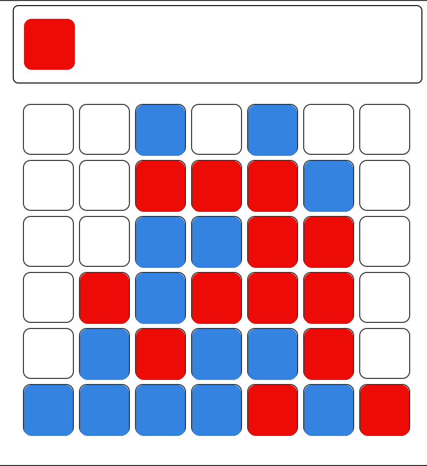

# Exercici 1
Tenint com a exemple el tres en ralla de la documentació oficial de React (https://es.react.dev/learn/tutorial-tic-tac-toe) implementa el "Connecta quatre" per poder jugar normalment. S'haurà d'utilitzar obligatòriament el Hook useState vist a classe.

## Important

Per a jugar clicar en la fitxa i menejar-la amb les fletxes esquerra i dreta. Per a deixar-la caure apretem la tecla Enter.

